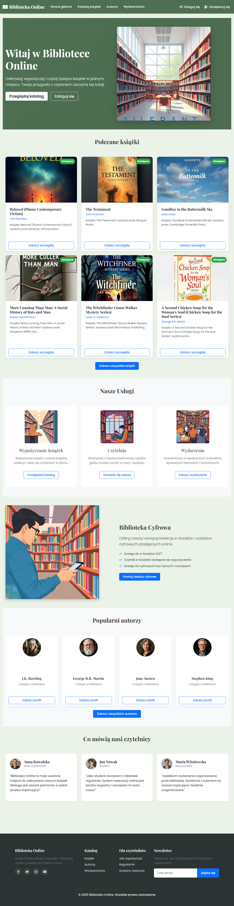
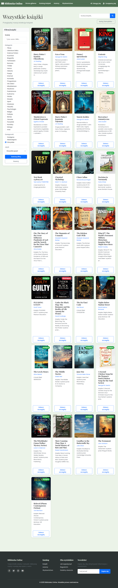
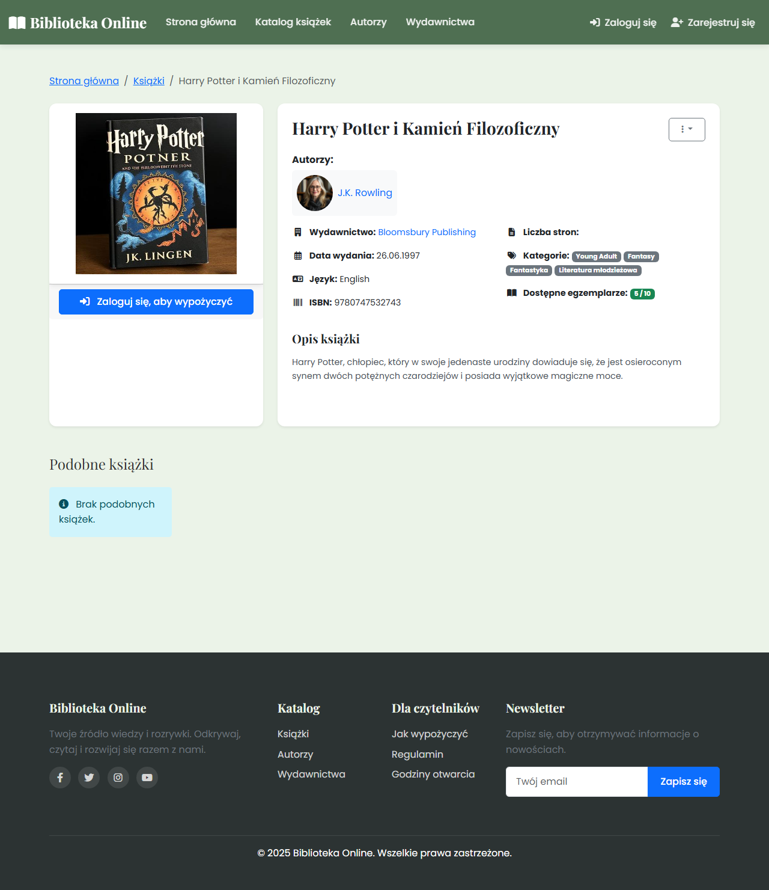
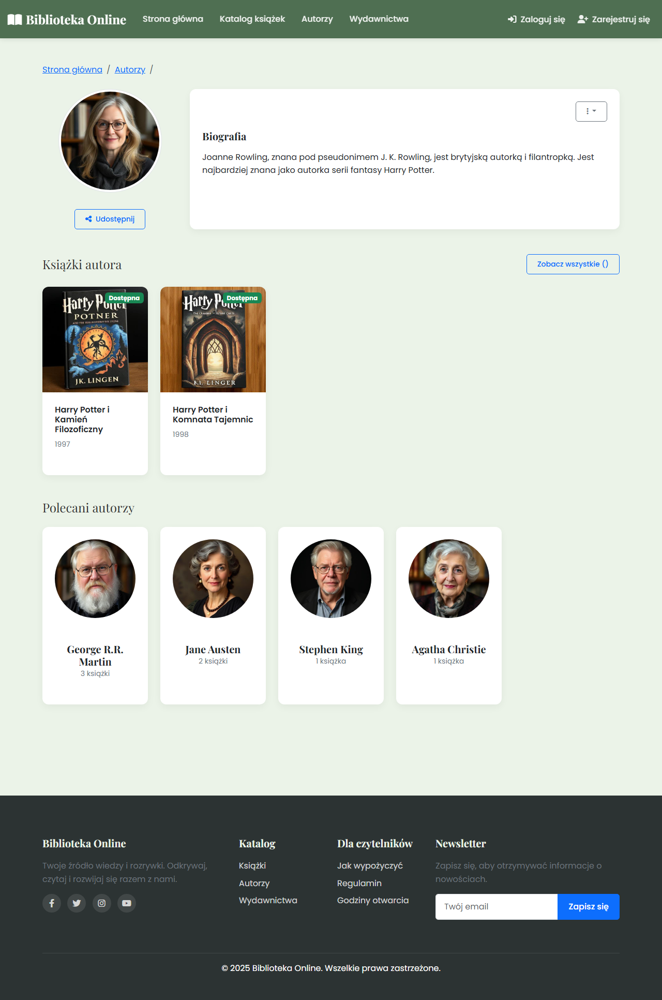
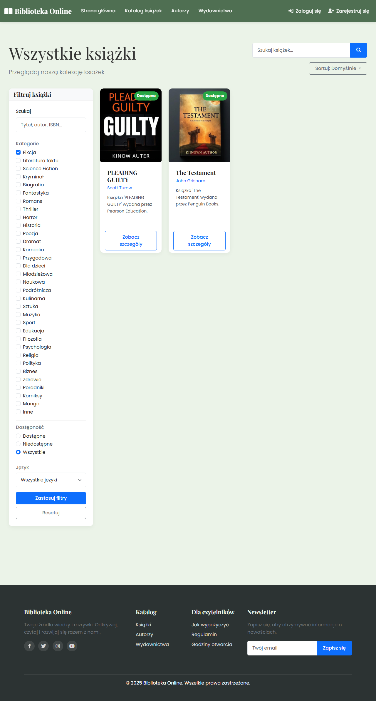

# Biblioteka Online - System Zarządzania Biblioteką

## 👥 Współtwórcy

- [Xza85hrf](https://github.com/Xza85hrf) - Główny deweloper
- [mateuszur](https://github.com/mateuszur) - Deweloper
- [KrystianRozwag](https://github.com/KrystianRozwag) - Deweloper

Projekt Django do zarządzania biblioteką online z funkcjami wypożyczania, rezerwacji, recenzji książek oraz generowania obrazów AI.


Rozbudowany system zarządzania biblioteką online. Aplikacja umożliwia kompleksowe zarządzanie zasobami bibliotecznymi, użytkownikami i procesami wypożyczeń.

## 📸 Zrzuty ekranu

Poniżej znajdują się wybrane zrzuty ekranu prezentujące interfejs aplikacji. Pełna galeria zrzutów ekranu dostępna jest w katalogu [screenshots](./screenshots).

### Strona główna



### Lista książek



### Szczegóły książki



### Lista autorów


### Szczegóły autora



### Filtrowanie książek



## 🌟 Główne funkcje

### Dla czytelników

- **Katalog książek** - Przeglądaj bogatą kolekcję książek z zaawansowanym wyszukiwaniem i filtrowaniem
  - Filtrowanie po autorach, wydawcach, gatunkach, dostępności i języku
  - Sortowanie według tytułu (A-Z, Z-A) i daty publikacji (od najnowszych, od najstarszych)
  - Wyszukiwanie pełnotekstowe po tytule, autorze i ISBN
  - Zaawansowana paginacja z zachowaniem kontekstu (filtry, sortowanie) podczas nawigacji
- **System rezerwacji** - Rezerwuj dostępne egzemplarze książek
- **Panel użytkownika** - Śledź swoje wypożyczenia, rezerwacje i historię
- **System recenzji** - Dodawaj opinie i oceny przeczytanych książek
- **Lista życzeń** - Twórz listę książek, które chcesz przeczytać
- **Zgłaszanie problemów** - Zgłaszaj błędy dotyczące książek, autorów i wydawców za pomocą intuicyjnego interfejsu modalnego

### Dla bibliotekarzy

- **Zarządzanie zasobami** - Dodawaj, edytuj i zarządzaj książkami, autorami i wydawcami
- **System wypożyczeń** - Obsługa procesu wypożyczania i zwrotów
- **Zarządzanie użytkownikami** - Rejestracja i aktywacja kont czytelników
- **Raporty i statystyki** - Generuj raporty dotyczące aktywności użytkowników i zasobów

### Dla administratorów

- **Pełna kontrola nad systemem** - Zarządzanie rolami użytkowników i uprawnieniami
- **Konfiguracja systemu** - Ustawienia globalne i parametry działania
- **Monitorowanie aktywności** - Śledzenie działań użytkowników w systemie

## 🔧 Technologie

### Backend

- **Django 5.1.5** - Zaawansowany framework webowy w Pythonie
- **Django REST Framework** - API RESTful dla integracji z frontendem
- **PostgreSQL** - Wydajna relacyjna baza danych
- **Celery** - Asynchroniczne zadania (np. wysyłka emaili)
- **Flux AI** - Generowanie obrazów AI dla książek, autorów, wydawców i użytkowników

### Frontend

- **Bootstrap 5** - Nowoczesny framework CSS z responsywnym designem
- **jQuery** - Usprawnienie interakcji użytkownika
- **Font Awesome 6** - Bogata biblioteka ikon
- **CKEditor** - Zaawansowany edytor tekstu dla treści
- **Modern UI** - Zmodernizowany interfejs z naturalnymi kolorami i płynną nawigacją
  - Paleta kolorów inspirowana naturą (odcienie zieleni i beżu)
  - Ulepszony nagłówek i stopka z intuicyjną nawigacją
  - Karty z efektami hover i płynnymi przejściami
  - Responsywny design dostosowany do wszystkich urządzeń
- **Pełna lokalizacja** - Interfejs w języku polskim
  - Wszystkie teksty przetłumaczone na język polski
  - Spolszczone tytuły książek i opisy
  - Dostosowane formaty dat i liczb do polskich standardów
- **Zoptymalizowany nagłówek** - Profesjonalny i spójny design
  - Konsolidacja opcji użytkownika w jednym menu
  - Sekcje w menu z nagłówkami dla lepszej organizacji
  - Ikony dla wszystkich opcji menu dla lepszej czytelności

### Generowanie obrazów

- **Podstawowe generowanie obrazów** - Automatyczne tworzenie okładek książek, portretów autorów i logo wydawców
- **Zaawansowane generowanie AI** - Integracja z Flux AI do tworzenia wysokiej jakości obrazów
- **Wykresy statystyczne** - Generowanie wykresów aktywności użytkowników, popularności książek i rozkładu gatunków
- **System zarządzania obrazami** - Kompleksowe narzędzia do optymalizacji, weryfikacji i naprawy obrazów
  - Optymalizacja wymiarów i rozmiaru plików obrazów (512x768 dla okładek, 512x512 dla autorów/wydawców)
  - Zapewnienie unikalnych i spójnych nazw plików z identyfikatorami
  - Weryfikacja i naprawa uszkodzonych referencji obrazów
  - Dedykowane polecenia do zarządzania obrazami:
    - `optimize_library_images` - Optymalizacja i zarządzanie obrazami bibliotecznymi
    - `ensure_unique_image_filenames` - Zapewnienie unikalnych i spójnych nazw plików
    - `verify_image_references` - Weryfikacja i naprawa uszkodzonych referencji
    - `fix_specific_books` - Naprawa książek z nieprawidłowymi tytułami/obrazami
    - `remove_duplicate_books` - Usuwanie duplikatów książek z zachowaniem danych

### Narzędzia deweloperskie

- **Docker** - Konteneryzacja aplikacji
- **Git** - Kontrola wersji
- **Poetry** - Zarządzanie zależnościami Pythona
- **Black & isort** - Formatowanie kodu

## 🧪 Testy

Projekt zawiera kompleksowy zestaw testów obejmujący modele, widoki, formularze, sygnały AI oraz tłumaczenia. Aby uruchomić testy, użyj następujących poleceń:

### Uruchomienie wszystkich testów

```bash
pytest
```

### Uruchomienie testów dla konkretnego modułu

```bash
pytest library/tests/test_models.py
pytest library/tests/test_views_basic.py
pytest library/tests/test_views_loans.py
pytest library/tests/test_views_reviews.py
pytest library/tests/test_views_late_fees.py
pytest library/tests/test_ai_signals.py
pytest library/tests/test_user_profile_images.py
pytest library/tests/test_translations.py
pytest library/tests/test_e2e.py
```

### Uruchomienie testów z pokryciem kodu

```bash
pytest --cov=library
```

### Generowanie raportu pokrycia kodu

```bash
pytest --cov=library --cov-report=html
```

## Zakres testów

1. **Testy modeli** - sprawdzają poprawność działania modeli, w tym metody `__str__`, `get_absolute_url`, właściwości oraz walidację.

2. **Testy widoków** - sprawdzają poprawność działania widoków, w tym renderowanie szablonów, przekazywanie kontekstu oraz obsługę formularzy.

3. **Testy sygnałów AI** - sprawdzają poprawność działania sygnałów odpowiedzialnych za generowanie obrazów AI.

4. **Testy tłumaczeń** - sprawdzają poprawność tłumaczeń interfejsu użytkownika oraz formatowania dat.

5. **Testy end-to-end** - sprawdzają kompletny przepływ użytkownika od przeglądania książek, przez wypożyczanie, zwracanie, recenzowanie, aż po obsługę opłat za opóźnienia.

## 🚀 Instalacja i uruchomienie

### Wymagania wstępne

- Python 3.10+
- PostgreSQL 13+ (lub SQLite dla wersji deweloperskiej)
- Node.js 16+ (dla asetów frontendowych)
- Redis (opcjonalnie, dla zadań asynchronicznych)

### Wymagane pakiety Python

- Django 5.1.5+
- django-filter
- Pillow (dla obsługi obrazów)
- Flux AI (dla generowania obrazów AI)

### Konfiguracja środowiska

1. Sklonuj repozytorium:

   ```bash
   git clone https://github.com/Xza85hrf/Online_Library_Django.git
   cd Online_Library_Django
   ```

2. Skonfiguruj środowisko wirtualne i zależności (wybierz jedną z opcji):

   **Opcja 1: Użyj skryptów automatycznych (zalecane):**

   Dla Windows:

   ```bash
   # Uruchom skrypt konfiguracyjny
   setup_env.bat

   # Uruchom projekt za pomocą interaktywnego menu
   run_library.bat
   ```

   Dla Linux/macOS:

   ```bash
   # Uruchom skrypt konfiguracyjny
   python setup.py

   # Uruchom projekt za pomocą interaktywnego menu
   python run_library.py
   ```

   **Opcja 2: Konfiguracja ręczna:**

   ```bash
   # Utworzenie wirtualnego środowiska
   python -m venv venv

   # Aktywacja środowiska (Windows)
   venv\Scripts\activate.bat

   # Aktywacja środowiska (Linux/macOS)
   source venv/bin/activate

   # Instalacja zależności
   pip install -r requirements.txt
   ```

   > ⚠️ **Uwaga**: Testy jednostkowe mogą nie działać poprawnie ze względu na problemy z importami. Jest to znany problem, który nie wpływa na funkcjonalność aplikacji. Główne funkcje aplikacji działają prawidłowo pomimo problemów z testami.

   **Opcja 3: Użyj Poetry:**

   ```bash
   # Instalacja Poetry (jeśli nie jest zainstalowane)
   pip install poetry
   
   # Instalacja zależności
   poetry install
   
   # Aktywacja środowiska
   poetry shell
   ```

3. Skonfiguruj zmienne środowiskowe:

   ```bash
   cp .env.example .env
   # Edytuj plik .env i ustaw odpowiednie wartości
   ```

4. Wykonaj migracje i utwórz konto administratora (lub użyj skryptu interaktywnego poniżej).

### Uruchomienie aplikacji

#### Opcja 1: Użycie skryptu interaktywnego

Po skonfigurowaniu środowiska, możesz użyć interaktywnego skryptu, który przeprowadzi Cię przez wszystkie potrzebne kroki:

Dla Windows:

```bash
run_library.bat
```

Dla Linux/macOS:

```bash
python run_library.py
```

Skrypt oferuje następujące opcje:

- Uruchomienie serwera deweloperskiego
- Konfiguracja bazy danych (migracje)
- Utworzenie konta administratora
- Zbieranie plików statycznych
- Uruchomienie testów
- Generowanie obrazów AI
- Optymalizacja obrazów bibliotecznych

#### Opcja 2: Ręczne uruchomienie

1. Przeprowadź migracje bazy danych:

   ```bash
   python manage.py migrate
   ```

2. Utwórz konto administratora:

   ```bash
   python manage.py createsuperuser
   ```

3. Uruchom serwer deweloperski:

   ```bash
   python manage.py runserver
   ```

4. Uruchom aplikację w przeglądarce:

   ```bash
   http://localhost:8000
   ```

5. Uruchom Celery w osobnym terminalu:
6. W osobnym terminalu uruchom Celery:

   ```bash
   celery -A config worker -l info
   ```

7. Otwórz przeglądarkę i przejdź do `http://localhost:8000`

## 🔐 Uwierzytelnianie

### Role użytkowników

- **Czytelnik** - Może przeglądać katalog, rezerwować i wypożyczać książki
- **Bibliotekarz** - Może zarządzać książkami, wypożyczeniami i użytkownikami
- **Administrator** - Pełny dostęp do wszystkich funkcji systemu

### Konta testowe

W systemie dostępne są następujące konta testowe:

#### Konto administratora

- **Email:** <admin@biblioteka.pl>
- **Hasło:** admin123

#### Konta testowe do różnych ról

**Administrator:**

- **Email:** <admin@test.com>
- **Hasło:** Test1234!
- **Uprawnienia:** Pełny dostęp do wszystkich funkcji systemu

**Bibliotekarz:**

- **Email:** <librarian@test.com>
- **Hasło:** Test1234!
- **Uprawnienia:** Zarządzanie książkami, wypożyczeniami i użytkownikami

**Czytelnik:**

- **Email:** <reader@test.com>
- **Hasło:** Test1234!
- **Uprawnienia:** Przeglądanie katalogu, rezerwowanie i wypożyczanie książek

Panel administratora dostępny jest pod adresem: [http://localhost:8000/admin/](http://localhost:8000/admin/)

## Dane testowe

Aplikacja zawiera przykładowe dane testowe, które pozwalają na szybkie zapoznanie się z funkcjonalnością systemu. Możesz korzystać z danych testowych do eksploracji funkcji bez konieczności tworzenia własnych wpisów.

## 📚 Przewodnik użytkownika

### System recenzji książek

Aplikacja umożliwia użytkownikom dodawanie recenzji i ocen książek, które przeczytali. System recenzji został zaimplementowany z następującymi funkcjami:

#### Funkcje recenzji dla czytelników

- **Dodawanie recenzji** - Możliwość oceny książki w skali 1-5 gwiazdek oraz dodania opisowej recenzji
- **Edycja recenzji** - Możliwość modyfikacji wcześniej dodanej recenzji
- **Usuwanie recenzji** - Możliwość usunięcia własnej recenzji
- **Przeglądanie recenzji** - Możliwość przeglądania recenzji innych czytelników

#### Funkcje recenzji dla bibliotekarzy i administratorów

- **Moderacja recenzji** - Zatwierdzanie lub odrzucanie recenzji przed ich publikacją
- **Zarządzanie recenzjami** - Możliwość edycji lub usunięcia dowolnej recenzji
- **Statystyki recenzji** - Dostęp do statystyk dotyczących ocen książek

#### Jak korzystać z systemu recenzji

1. **Dodawanie recenzji**:
   - Przejdź do strony szczegółów książki
   - Kliknij zakładkę "Recenzje"
   - Kliknij przycisk "Dodaj recenzję"
   - Wypełnij formularz recenzji (ocena, tytuł, treść)
   - Zatwierdź recenzję

2. **Edycja recenzji**:
   - Przejdź do strony szczegółów książki
   - Znajdź swoją recenzję w zakładce "Recenzje"
   - Kliknij przycisk "Edytuj" przy swojej recenzji
   - Wprowadź zmiany w formularzu
   - Zatwierdź zmiany

3. **Usuwanie recenzji**:
   - Przejdź do strony szczegółów książki
   - Znajdź swoją recenzję w zakładce "Recenzje"
   - Kliknij przycisk "Usuń" przy swojej recenzji
   - Potwierdź usunięcie recenzji

> **Uwaga**: Każdy użytkownik może dodać tylko jedną recenzję dla danej książki. Recenzje są moderowane przed publikacją.

System opłat za przetrzymanie automatycznie nalicza opłaty za książki zwrócone po terminie. Funkcjonalność ta pomaga w utrzymaniu dyscypliny wypożyczeń i zapewnia sprawny obieg książek w bibliotece.

#### Funkcje opłat dla czytelników

- **Przeglądanie opłat** - Możliwość sprawdzenia naliczonych opłat za przetrzymanie książek
- **Opłacanie kar** - Możliwość uiśczenia opłat za przetrzymanie online
- **Wnioskowanie o umorzenie** - Możliwość złożenia wniosku o umorzenie opłaty w wyjątkowych okolicznościach
- **Historia opłat** - Dostęp do historii naliczonych i opłaconych kar

#### Funkcje opłat dla bibliotekarzy i administratorów

- **Zarządzanie opłatami** - Możliwość przeglądania, edycji i usuwania opłat
- **Rozpatrywanie wniosków o umorzenie** - Możliwość zatwierdzania lub odrzucania wniosków o umorzenie opłat
- **Konfiguracja systemu opłat** - Możliwość ustawienia dziennej stawki za przetrzymanie oraz innych parametrów
- **Statystyki opłat** - Dostęp do statystyk dotyczących naliczonych, opłaconych i umorzonych kar

#### Jak korzystać z systemu opłat

1. **Przeglądanie opłat**:
   - Zaloguj się na swoje konto
   - Przejdź do sekcji "Moje opłaty za przetrzymanie"
   - Zobacz listę wszystkich opłat wraz z ich statusem

2. **Opłacanie kar**:
   - Wybierz opłatę, którą chcesz uiścić
   - Kliknij przycisk "Opłać"
   - Wypełnij formularz płatności
   - Zatwierdź płatność

3. **Wnioskowanie o umorzenie**:
   - Wybierz opłatę, o której umorzenie chcesz wnioskować
   - Kliknij przycisk "Złóż wniosek o umorzenie"
   - Podaj uzasadnienie wniosku
   - Zatwierdź wniosek

> **Uwaga**: Opłaty za przetrzymanie są naliczane automatycznie po zwróceniu książki po terminie. Stawka dzienna jest ustalana przez administratora systemu.

### System generowania obrazów

Aplikacja posiada zaawansowany system generowania obrazów, który automatycznie tworzy okładki książek, portrety autorów, logo wydawców oraz wykresy statystyczne. System oferuje dwa tryby generowania obrazów: podstawowy oraz zaawansowany z wykorzystaniem sztucznej inteligencji.

#### Podstawowe generowanie obrazów

Podstawowy generator obrazów wykorzystuje bibliotekę Pillow do tworzenia prostych grafik:

- **Okładki książek** - Automatyczne generowanie kolorowych okładek z tytułem książki
- **Portrety autorów** - Tworzenie prostych portretów z imieniem i nazwiskiem autora
- **Logo wydawców** - Generowanie logo z nazwą wydawnictwa

#### Zaawansowane generowanie AI

Zaawansowany generator obrazów integruje się z modelem Flux AI dla tworzenia realistycznych grafik:

- **Wysokiej jakości okładki** - Generowanie realistycznych okładek książek na podstawie opisu
- **Portrety autorów w stylu fotograficznym** - Tworzenie realistycznych portretów autorów
- **Profesjonalne logo wydawców** - Generowanie unikalnych i profesjonalnych logo

System automatycznie wykrywa dostępność Flux AI i w przypadku problemów z zależnościami przełącza się na podstawowy generator obrazów.

#### Wykresy statystyczne

Aplikacja generuje następujące wykresy statystyczne:

- **Historia wypożyczeń** - Wykres liniowy pokazujący liczbę wypożyczeń w czasie
- **Popularne książki** - Wykres słupkowy pokazujący najczęściej wypożyczane książki
- **Aktywność użytkowników** - Wykres słupkowy pokazujący użytkowników z największą liczbą wypożyczeń
- **Rozkład gatunków** - Wykres kołowy pokazujący popularność poszczególnych gatunków książek

#### Jak korzystać z generatora obrazów

1. **Generowanie wszystkich obrazów**:

   ```bash
   python generate_images.py
   ```

2. **Generate specific types of images**:

   ```bash
   # Generate only book covers
   python generate_images.py --type covers

   # Generate only author portraits
   python generate_images.py --type authors

   # Generate only publisher logos
   python generate_images.py --type publishers

   # Generate only statistical charts
   python generate_images.py --type charts
   ```

3. **Test the advanced AI image generation**:

   ```bash
   python test_image_generation.py --mode advanced
   ```

> **Note**: The advanced AI image generation requires a properly configured Flux AI environment. If any issues arise, the system will automatically fall back to basic image generation.

## Reporting and Statistics System

System raportów i statystyk dostarcza zaawansowane narzędzia do analizy danych bibliotecznych, umożliwiając podejmowanie decyzji w oparciu o dane oraz monitorowanie kluczowych wskaźników wydajności biblioteki.

### Funkcje Raportów i Statystyk

#### Funkcje dla administratorów i bibliotekarzy

- **Dashboardy** - Konfigurowalne pulpity z widgetami prezentującymi najważniejsze statystyki
- **Raporty** - Możliwość generowania szczegółowych raportów na różne tematy
- **Eksport danych** - Eksport raportów do różnych formatów (CSV, Excel, JSON)
- **Planowanie raportów** - Możliwość automatycznego generowania raportów według harmonogramu

#### Typy raportów

- **Historia wypożyczeń** - Szczegółowa analiza wypożyczeń w wybranym okresie
- **Popularne książki** - Statystyki najczęściej wypożyczanych i najwyżej ocenianych książek
- **Aktywność użytkowników** - Analiza aktywności czytelników i recenzentów
- **Przetrzymane książki** - Statystyki dotyczące przetrzymanych książek
- **Przychody** - Analiza przychodów z opłat za przetrzymanie
- **Inwentarz** - Statystyki dotyczące stanu księgozbioru

#### Jak korzystać z systemu raportów

1. **Przeglądanie dashboardu**:
   - Zaloguj się jako administrator lub bibliotekarz
   - Przejdź do sekcji "Raporty i statystyki" z menu administratora
   - Przeglądaj widgety na domyślnym dashboardzie

2. **Tworzenie raportu**:
   - Kliknij przycisk "Nowy Raport"
   - Wybierz typ raportu
   - Podaj tytuł i opis raportu
   - Ustaw parametry raportu
   - Uruchom raport

3. **Eksportowanie danych**:
   - Otwórz szczegóły wybranego raportu
   - Wybierz format eksportu (CSV, Excel, JSON)
   - Pobierz plik z raportem

4. **Tworzenie dashboardu**:
   - Kliknij przycisk "Nowy Dashboard"
   - Podaj tytuł i opis dashboardu
   - Dodaj widgety do dashboardu
   - Skonfiguruj źródła danych dla widgetów

> **Uwaga**: System raportów i statystyk jest dostępny tylko dla administratorów i bibliotekarzy. Dane prezentowane w raportach są automatycznie odświeżane przy każdym uruchomieniu raportu.

### User Roles and Permissions

#### Dla czytelników

#### Wyszukiwanie książek

- Użyj wyszukiwarki na górze strony, aby znaleźć książki po tytule, autorze lub ISBN
- Filtruj wyniki według kategorii, dostępności i innych kryteriów
- Sortuj wyniki według popularności, ocen lub daty dodania

#### Wypożyczanie książek

1. Zaloguj się na swoje konto
2. Znajdź interesującą Cię książkę
3. Sprawdź dostępność w systemie
4. Kliknij "Wypożycz" i potwierdź wybór
5. Odbierz książkę w wybranej placówce w ciągu 3 dni

#### Rezerwacja książek

1. Jeśli książka jest aktualnie wypożyczona, możesz ją zarezerwować
2. Otrzymasz powiadomienie, gdy książka będzie dostępna
3. Masz 48 godzin na odbiór zarezerwowanej książki

#### System oceniania i recenzji

- Oceń przeczytane książki w skali 1-5 gwiazdek
- Napisz szczegółową recenzję
- Oznaczaj ulubione cytaty
- Twórz listy książek do przeczytania

### Dla bibliotekarzy

#### Dodawanie nowych książek

1. Przejdź do panelu bibliotekarza
2. Wybierz "Dodaj nową książkę"
3. Wypełnij formularz danymi książki
4. Dodaj okładkę i szczegóły wydawnicze
5. Zatwierdź dodanie książki do katalogu

#### Obsługa wypożyczeń

1. Zeskanuj kod kreskowy książki
2. Zeskanuj kartę czytelnika
3. Potwierdź wypożyczenie
4. Wydrukuj potwierdzenie

#### Zarządzanie zwrotami

1. Zeskanuj zwracaną książkę
2. Sprawdź stan książki
3. Nalicz ewentualne kary
4. Zatwierdź zwrot w systemie

## 📊 Status projektu

### Wersja: 1.9.0

### Najnowsze zmiany

- Reorganizacja struktury projektu dla lepszej organizacji kodu
- Kompleksowe testy dla wszystkich funkcji aplikacji
- Generowanie obrazów AI dla książek, autorów, wydawców i użytkowników
- Aktualizacja dokumentacji projektu

- Dodano panel administracyjny dla bibliotekarzy
- Usprawniono wyszukiwanie i filtrowanie
- Dodano system oceniania i recenzji

### Znane problemy

- W niektórych przeglądarkach mogą występować problemy z wyświetlaniem okładek
- Eksport do PDF czasami zawiesza się przy dużych zbiorach danych

## 📁 Struktura projektu

Projekt jest zorganizowany w następujący sposób:

```text
Online_Library_Django/
├── accounts/                # Aplikacja użytkowników i autentykacji
├── docs/                   # Dokumentacja projektu
├── library/                # Główna aplikacja biblioteki
│   ├── ai_utils/          # Narzędzia do generowania obrazów AI
│   ├── management/        # Polecenia niestandardowe
│   ├── migrations/        # Migracje bazy danych
│   ├── templatetags/      # Niestandardowe tagi szablonu
│   ├── tests/             # Testy jednostkowe i integracyjne
│   ├── ui_images/         # Generowanie obrazów UI
│   ├── utils/             # Narzędzia pomocnicze
├── library_project/       # Konfiguracja projektu Django
├── media/                 # Pliki przesyłane przez użytkowników
│   ├── authors/          # Zdjęcia autorów
│   ├── covers/           # Okładki książek
│   ├── profile_pics/     # Zdjęcia profili użytkowników
│   ├── publishers/       # Loga wydawców
├── reports/               # Aplikacja raportów i statystyk
├── screenshots/           # Zrzuty ekranu aplikacji
├── scripts/               # Skrypty narzędziowe
├── static/                # Pliki statyczne (CSS, JS, obrazy)
├── templates/             # Globalne szablony HTML
├── manage.py              # Skrypt zarządzania Django
├── README.md              # Dokumentacja projektu
├── requirements.txt       # Zależności Pythona
```

## 🤝 Współpraca

Zapraszamy do współpracy nad projektem! Zobacz [CONTRIBUTING.md](CONTRIBUTING.md) aby dowiedzieć się, jak możesz pomóc.

## 📄 Licencja

Ten projekt jest objęty licencją MIT. Szczegóły w pliku [LICENSE](LICENSE).

## Autor

Projekt stworzony jako zadanie z przedmiotu "Aplikacje internetowe w Django".
