# Library Website Screenshots

These screenshots showcase the Library Website interface without requiring you to run the project.

## Main Pages

### Home

### Books List

### Authors List

### Publishers List

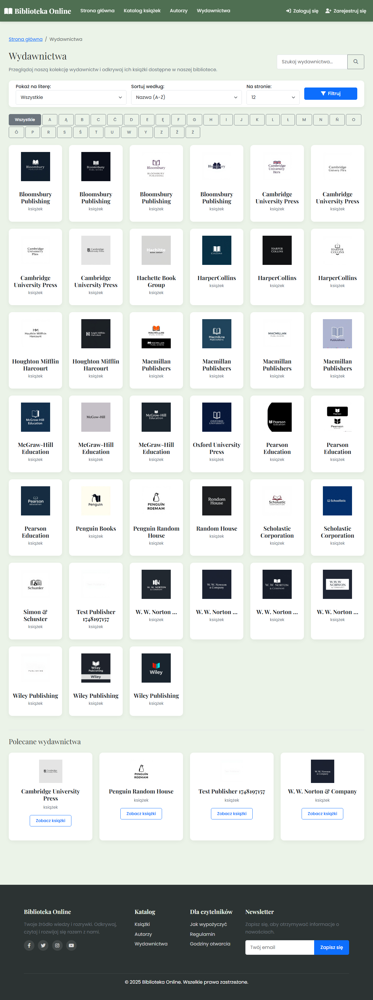

### Book Detail

### Author Detail

### Publisher Detail

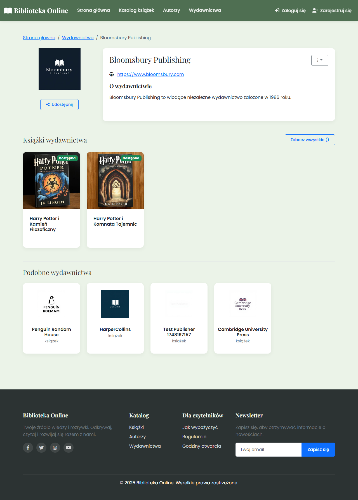

### Books Fiction

### Books Fantasy

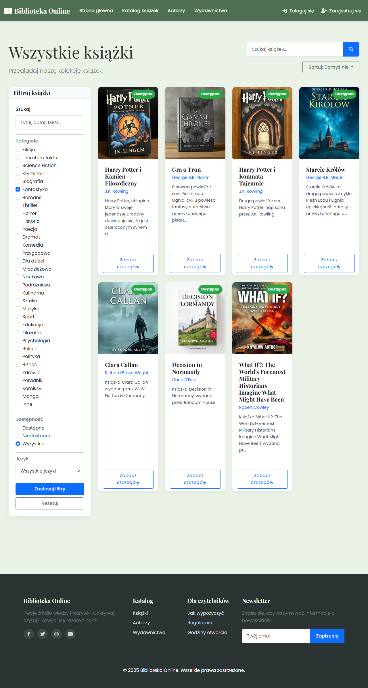

### Books Available

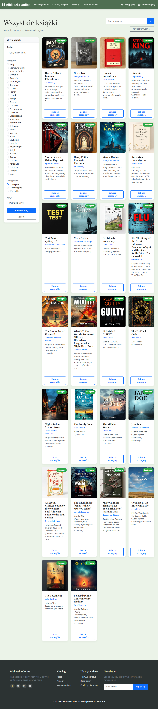

### About

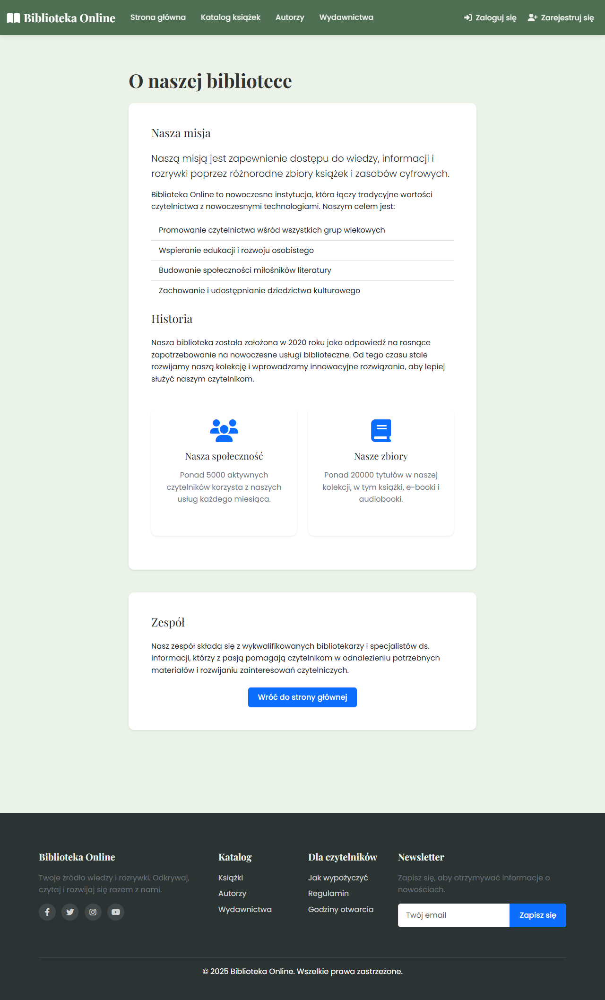

### Events

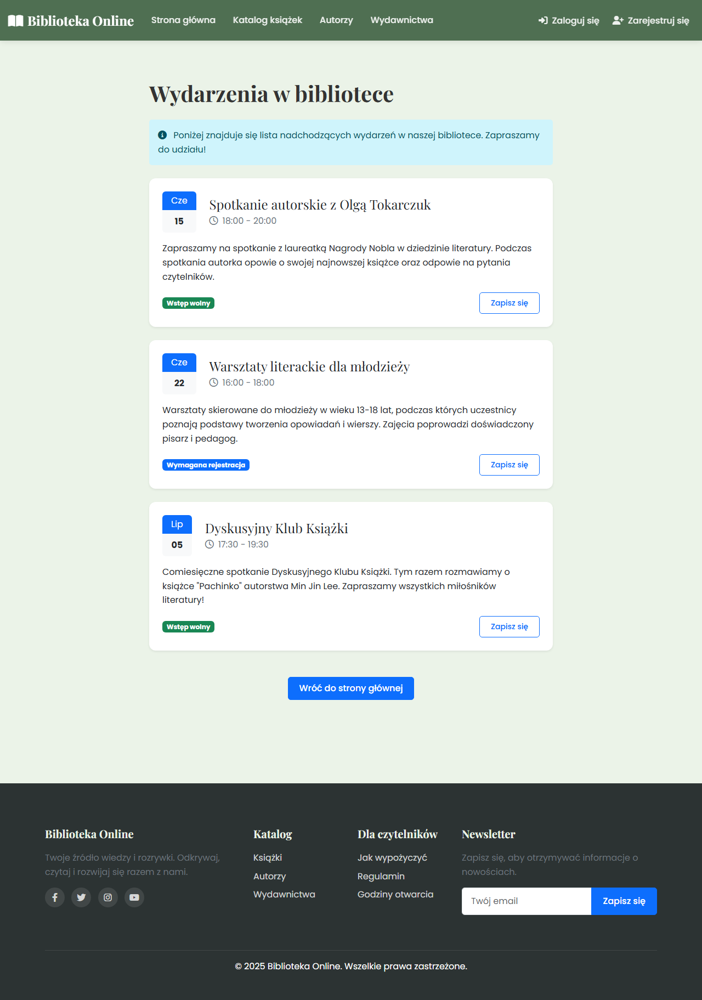

### Digital Library

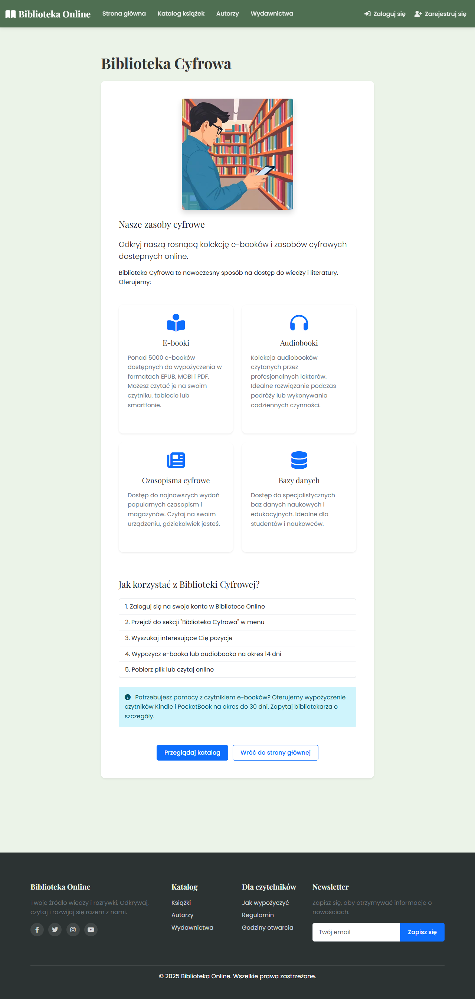

### How To Borrow

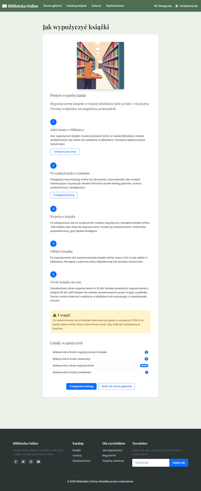

### Rules

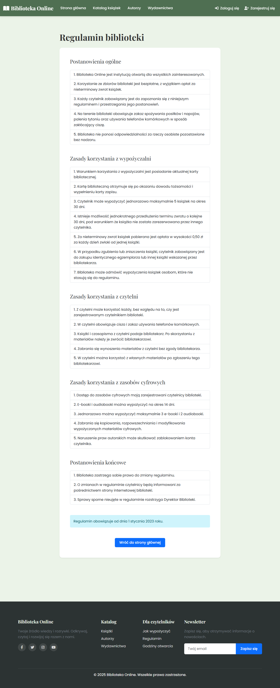

### Opening Hours

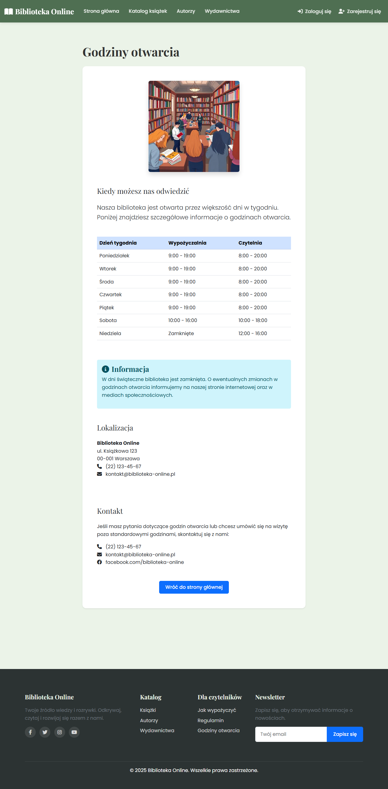

## Additional Book Details

### Book Detail Example 1

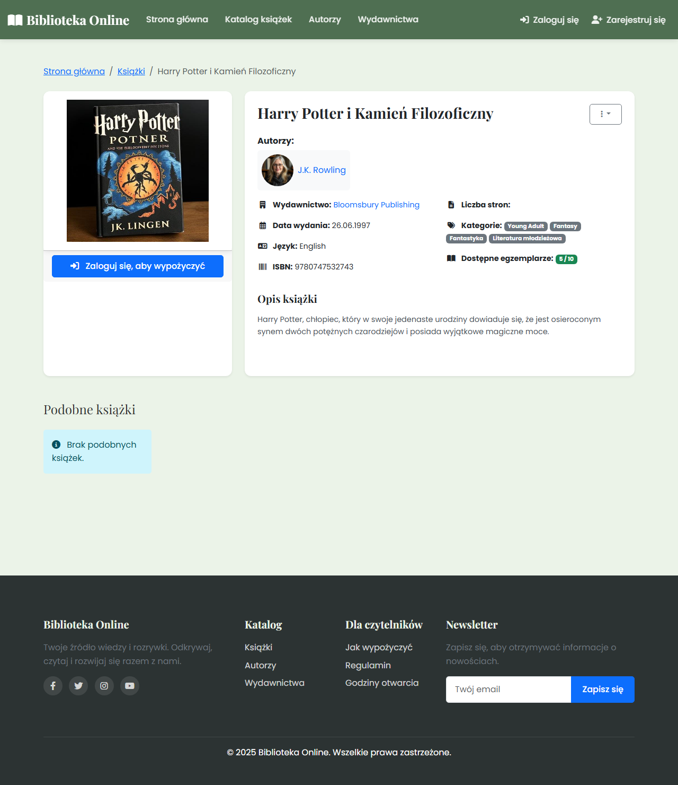

### Book Detail Example 2

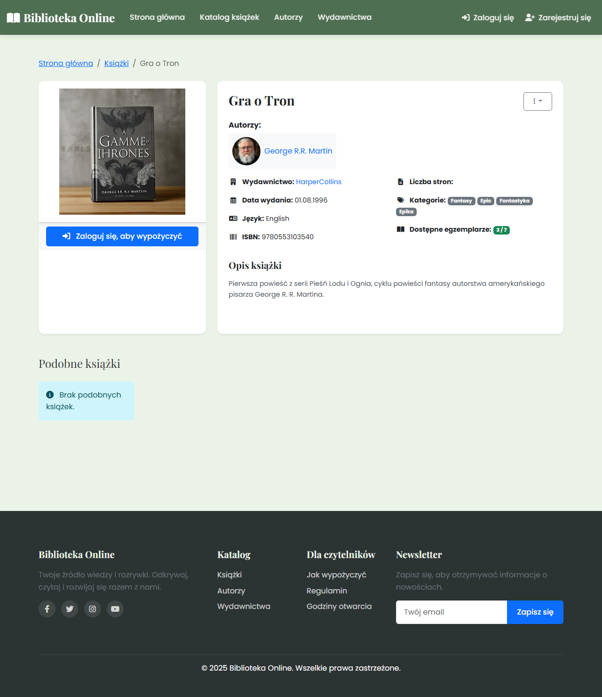

