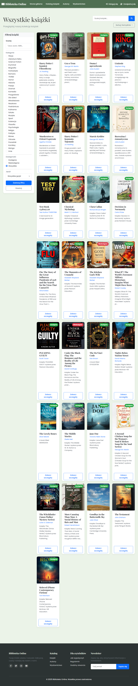
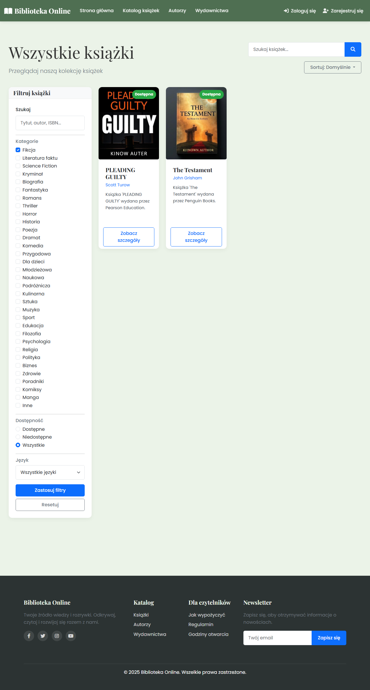

# Library Website Screenshots

These screenshots showcase the Library Website interface without requiring you to run the project.

## Main Pages

### Home

### Books List

### Authors List

### Publishers List

### Book Detail

### Author Detail

### Publisher Detail

### Books Fiction

### Books Fantasy

### Books Available

### About

### Events

### Digital Library

### How To Borrow

### Rules

### Opening Hours

## Additional Book Details

### Book Detail Example 1

### Book Detail Example 2

